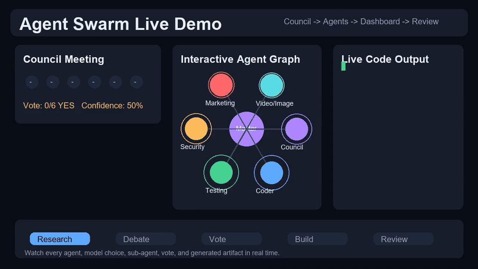

# Agent Swarm

[](./LICENSE)

[](https://github.com/farhanic017)


> Created by [Farhan Dhrubo](https://github.com/farhanic017) - [Patreon](https://www.patreon.com/farhanic017) - [Submit an issue](https://github.com/farhanic017/agent-swarm/issues)

A production-grade, multi-agent orchestration framework. Specialized AI agents collaborate through intelligent handoffs to solve complex tasks.

## Live Demo

This autoplaying preview shows the swarm flow: council meeting, agent graph, live code output, provider routing, and final review.



## Architecture

```
User Input → [Triage Agent] → [Researcher] → [Writer] → [Reviewer]
                 │                │             │           │
                 └── routes       └── hands     └── hands   └── returns
                     tasks            off           off         result
```

### Layers

| Layer | Components | Purpose |
|-------|-----------|---------|
| **Providers** | Azure, OpenRouter, Google, OpenAI, Anthropic, OpenClaw, Manus, ElevenLabs, OpenAI-compatible gateways | Abstracts LLM, media, voice, and agent-gateway APIs behind unified interface |
| **Core** | Agent, Orchestrator, State, Handoff | Agent definitions, execution loop, memory |
| **Tools** | Web search, file ops, code exec | Functions agents can call |
| **Safety** | Loop detector, timeout manager | Prevents infinite loops and runaway costs |
| **Agents** | Triage, Researcher, Coder, Writer, Reviewer | Pre-built specialized roles |

## Quick Start

### Drop-in install

Send this repository link to your AI coding assistant:

```text
https://github.com/farhanic017/agent-swarm
```

Ask it to clone the repo, run the tests, and start Agent Swarm. The project is designed for Codex, OpenCode, Claude Code, Cursor, and other coding agents that can run terminal commands.

### Manual install

```bash
# Clone
git clone https://github.com/farhanic017/agent-swarm.git
cd agent-swarm

# Install dependencies
pip install -r requirements.txt

# Verify everything
python -m pytest -q

# Interactive mode
python main.py

# Headless mode
python main.py "Research AI agents and write a report"

# List available agents
python main.py --list-agents

# Run only a council vote with full reasoning
python main.py --council "should we add dark mode?"

# Export the real-time dashboard demo
python main.py --dashboard examples/agent_swarm_dashboard.html "build a feature"

# Benchmark every internal swarm feature without paid model calls
python -m swarm.core.performance_benchmark --features --skip-models --output examples/full_swarm_feature_benchmark.json

# Benchmark features plus live Opus comparisons when provider credits/API access exist
python -m swarm.core.performance_benchmark --features --models openrouter:anthropic/claude-opus-4.8 openrouter:anthropic/claude-opus-4.7 --max-tokens 260 --output examples/full_swarm_plus_opus_benchmark.json

# Load custom agents
python main.py --custom-agents examples/agents.json
```

### API keys

No API keys are committed to this repo. Add keys through environment variables or your local OpenCode config only:

```bash
set OPENAI_API_KEY=...
set OPENAI_TRANSCRIPTION_MODEL=whisper-1
set OPENAI_TTS_MODEL=tts-1
set AZURE_OPENAI_API_KEY=...
set AZURE_OPENAI_ENDPOINT=...
set OPENROUTER_API_KEY=...
set ELEVENLABS_API_KEY=...
set MANUS_API_KEY=...
set MANUS_BASE_URL=https://your-manus-compatible-endpoint/v1
```

Local files such as `.env`, `config.json`, private keys, logs, and swarm state are ignored by git.

## Expanded Swarm Features

- **20+ built-in agents** across coding, business, and creative work: backend API, frontend UI, coding, security, testing, debugging, documentation, marketing, finance, analytics, trading, legal, UX research, localization, product management, sales, design, photo editing, video editing, Figma control, and council coordination.
- **4 pillars** organize the swarm: `code`, `see`, `design`, and `act`.
- **Agent Council System** automatically runs on every swarm request before agent work starts. It collects specialist reasoning, surfaces risks and conflicts, tallies proceed/reject votes, and returns a confidence score. `--council` is available when you want only the meeting and vote.
- **Different model types per agent** are explicit in the catalog: coding, reasoning, chat, vision, best, and cheap model preferences route through the model switcher/fallback chain.
- **OpenClaw support** detects `OPENCLAW_BASE_URL` or `OPENCLAW_ENDPOINT`, optional `OPENCLAW_API_KEY`, and `OPENCLAW_MODEL`, then routes OpenClaw as an OpenAI-compatible `agent_gateway`.
- **Manus support** detects `MANUS_API_KEY`, `MANUS_BASE_URL`/`MANUS_ENDPOINT`, and `MANUS_MODEL`, then routes Manus as a built-in OpenAI-compatible agent/workflow provider.
- **ElevenLabs support** detects `ELEVENLABS_API_KEY`, `ELEVENLABS_STT_MODEL`, and `ELEVENLABS_TTS_MODEL`, then routes native speech-to-text and text-to-speech requests through the ElevenLabs adapter.
- **Hermes support** recognizes Hermes/Nous model names as chat+reasoning capable options for writing, analytics, council, and planning work.
- **Per-agent sub-agents** are built in. Each specialist has default helper roles and access to the `spawn_agent` tool for delegating focused work when needed.
- **AI Reviewer Agent** reviews every individual agent output before integration for security vulnerabilities, performance issues, and logic errors. It produces GitHub PR inline comment payloads and routes fixes back to the responsible agent before the master connects the project parts.
- **XSS validation** flags risky raw HTML rendering such as `dangerouslySetInnerHTML`, `innerHTML = userInput`, unescaped template HTML, and injected `<script>` blocks before frontend work is integrated.
- **/compact context management** creates project-memory summaries that preserve architecture, completed work, pending work, decisions, risks, artifacts, recent turns, and next-agent instructions while dropping old conversational noise.
- **Architecture-first onboarding** tells the first agent to inspect project structure once, then future agents continue from compact summaries and inspect only relevant files to reduce token waste.
- **Docs integration planning** selects framework/API docs such as Next.js, React, Tailwind, Supabase, Stripe, Figma, Vercel, Cloudflare, Three.js, ElevenLabs, and Manus before version-sensitive code is generated.
- **Text, voice, image, video, and prompt agents** are first-class roles. The swarm includes text editing, prompt generation, speech-to-text, text-to-speech, image generation/editing, video generation/editing, Figma/design control, and browser prototype checks.
- **Image and video generation model support** routes configured `image_generation` and `video_generation` models through provider adapters. OpenAI, Azure OpenAI/Foundry-style endpoints, and OpenAI-compatible media gateways can expose `images/generations` and configurable video generation routes.
- **Voice-to-text and text-to-speech support** routes configured `speech_to_text` and `text_to_speech` models through OpenAI-compatible audio routes or native ElevenLabs endpoints. Voice agents can create transcript/subtitle workflows and narration/voiceover workflows without forcing audio work onto chat agents.
- **Mockup video support** plans storyboard, generated/imported assets, motion, render preview, and export with draft-resolution guardrails.
- **Photo/video/audio app adapter registry** covers Adobe Photoshop, Lightroom, Illustrator, Premiere Pro, After Effects, Media Encoder, Audition, DaVinci Resolve, CapCut, Final Cut Pro, Blender, Figma, Canva, GIMP, Krita, Affinity tools, Runway, Pika, Kling, ElevenLabs, Manus, Whisper, Audacity, Stable Diffusion, and ComfyUI.
- **Temporary skill acquisition** plans missing work skills, installs run-scoped skill manifests, injects them into the swarm, and deletes temporary downloads after all agents complete.
- **MCP marketplace planner** includes connectors for dev infrastructure, productivity, messaging, design, CRM, finance, e-commerce, marketing, storage, HR, legal, research, healthcare, travel, music, and specialized tools. It plans only task-relevant MCPs so broad access is not enabled by default.
- **Local model, CLI, MCP, and IDE support discovery** detects Ollama, LM Studio, vLLM, llama.cpp, Jan, KoboldCPP, text-generation-webui, LocalAI, Codex, OpenCode, Mistral Vibe, Claude Code, Gemini/Qwen CLIs, Aider, Cursor, Windsurf, VS Code, Zed, JetBrains surfaces, and common MCP servers.
- **Token budget guardrails** estimate a single-agent run and cap the default swarm run to a small bounded overhead, with max iterations and parallel-agent limits derived from that budget.
- **Browser control tools** expose `browser_open`, `browser_snapshot`, `browser_click`, `browser_get_title`, and `browser_stop` through the tool registry for agents that need web or prototype testing.
- **Full agent communication mesh** comes online at the start of every run. Agents can use direct messages, broadcasts, shared artifacts, and live consciousness updates so every specialist can coordinate with every other specialist.
- **Replacement-model memory** protects model fallback. If a model is out of credits, rate limited, or otherwise fails, the replacement model receives the complete handoff context once, then receives compact reminders on future retries so it continues the same work instead of restarting.
- **Master integration review** runs after the swarm finishes. It connects the council decision, sub-agent plan, agent outputs, and shared artifacts, then emits a `master_review` release gate with checks, risks, status, and confidence.
- **Continuous learning** writes an automatic run lesson after each completed swarm run and injects relevant lessons into future agent prompts.
- **Real-Time Dashboard** exports an HTML dashboard where you can click agents, see their model type, inspect helper sub-agents, watch code type character-by-character, inspect logic flow, view file growth, and review council votes.

## Auto-Detected Providers

The swarm automatically detects available LLM providers from:

1. **OpenCode config** (`~/.config/opencode/opencode.jsonc`) — best for existing users
2. **Environment variables** — `AZURE_OPENAI_API_KEY`, `OPENAI_API_KEY`, `OPENAI_TRANSCRIPTION_MODEL`, `OPENAI_TTS_MODEL`, `OPENROUTER_API_KEY`, `ANTHROPIC_API_KEY`, `OPENCLAW_BASE_URL`, `OPENCLAW_ENDPOINT`, `OPENCLAW_MODEL`, `ELEVENLABS_API_KEY`, `MANUS_API_KEY`, `MANUS_BASE_URL`, `MANUS_MODEL`
3. **Fallback** — uses OpenRouter free tier as last resort

The **best model** is used for the triage/routing agent, and **cheaper models** for worker agents.

## Image & Video Generation Models

Agent Swarm can route media work to dedicated generation models instead of forcing photo/video agents onto chat models.

### Model discovery

Media models are detected from OpenCode provider metadata or model names:

```jsonc
{
  "provider": {
    "openai": {
      "options": { "apiKey": "..." },
      "models": {
        "gpt-image-1": { "modalities": ["image_generation"] },
        "sora": { "modalities": ["video_generation"] }
      }
    },
    "azure-foundry": {
      "options": {
        "apiKey": "...",
        "endpoint": "https://example.openai.azure.com"
      },
      "models": {
        "image-prod": {
          "deployment": "image-prod",
          "modalities": ["image_generation"]
        },
        "video-prod": {
          "deployment": "video-prod",
          "apiStyle": "foundry-v1",
          "modalities": ["video_generation"]
        }
      }
    }
  }
}
```

Name-based detection also recognizes families such as `gpt-image`, `dall-e`, `imagen`, `flux`, `stable-diffusion`, `sdxl`, `sora`, `veo`, `runway`, `kling`, `wan`, and `video`.

### Python API

```python
from swarm.config import SwarmConfig
from swarm.providers.base import MediaGenerationRequest
from swarm.providers.factory import ProviderFactory

config = SwarmConfig.from_opencode_config()

image_model = config.find_model("image_generation")
image_func = ProviderFactory.get_image_func(config, image_model)
image = await image_func(MediaGenerationRequest(
    prompt="A polished coffee brand hero image",
    size="1024x1024",
))

video_model = config.find_model("video_generation")
video_func = ProviderFactory.get_video_func(config, video_model)
video = await video_func(MediaGenerationRequest(
    prompt="Steam rising from a coffee cup in a smooth product animation",
    duration=5,
))
```

### Provider behavior

| Provider type | Image route | Video route |
|---------------|-------------|-------------|
| OpenAI | `/images/generations` | `/videos/generations` by default, override with `extra.path` |
| Azure deployment style | `/openai/deployments/{deployment}/images/generations` | `/openai/deployments/{deployment}/videos/generations` |
| Azure Foundry/OpenAI v1 style | `/openai/v1/images/generations` | `/openai/v1/videos/generations` |
| OpenAI-compatible gateway | `/images/generations` | `/videos/generations` by default, override with `extra.path` |

The `photo_editor` agent prefers `image_generation` models and the `video_editor` agent prefers `video_generation` models. If no generator is configured, normal vision/chat fallback still applies through the model switcher.

## Voice & Speech Models

Agent Swarm can route audio work to dedicated speech models instead of spending chat-model tokens on transcription or voiceover tasks.

### Voice model discovery

```jsonc
{
  "provider": {
    "elevenlabs": {
      "options": { "apiKey": "..." },
      "models": {
        "scribe_v1": { "modalities": ["speech_to_text"] },
        "eleven_multilingual_v2": { "modalities": ["text_to_speech"] }
      }
    },
    "openai": {
      "options": { "apiKey": "..." },
      "models": {
        "whisper-1": { "modalities": ["speech_to_text"] },
        "tts-1": { "modalities": ["text_to_speech"] }
      }
    }
  }
}
```

Name-based detection also recognizes `whisper`, `scribe`, `transcribe`, `stt`, `tts`, `voice`, `speech`, and `eleven`.

### Python API

```python
from swarm.config import SwarmConfig
from swarm.providers.base import AudioSpeechRequest, AudioTranscriptionRequest
from swarm.providers.factory import ProviderFactory

config = SwarmConfig.from_opencode_config()

transcription_model = config.find_model("speech_to_text")
transcribe = ProviderFactory.get_transcription_func(config, transcription_model)
transcript = await transcribe(AudioTranscriptionRequest(
    audio_path="meeting.wav",
    language="en",
))

voice_model = config.find_model("text_to_speech")
speak = ProviderFactory.get_speech_func(config, voice_model)
voiceover = await speak(AudioSpeechRequest(
    text="Agent Swarm council approved the launch.",
    voice="Rachel",
    output_format="mp3",
))
```

### Voice provider behavior

| Provider type | Speech-to-text route | Text-to-speech route |
|---------------|----------------------|----------------------|
| OpenAI | `/audio/transcriptions` | `/audio/speech` |
| OpenAI-compatible gateway | `/audio/transcriptions` by default, override with `extra.path` | `/audio/speech` by default, override with `extra.path` |
| ElevenLabs | `/speech-to-text` | `/text-to-speech/{voice}` |

The `voice_transcriber` agent prefers `speech_to_text` models and the `voice_generator` agent prefers `text_to_speech` models. `plan_voice_workflow` builds low-lag transcript, subtitle, narration, and voiceover plans with approval gates for voice cloning.

## Pre-Integration AI Review

Before the master agent connects agent outputs together, each individual agent turn is scanned by the AI Reviewer pipeline:

1. **Security review** checks for hardcoded secrets, unsafe shell execution, unsafe `eval`/`exec`, and simple injection patterns.
2. **Performance review** checks for obvious unbounded loops, nested-loop hot spots, and synchronous network work inside loops.
3. **Logic review** checks for bare `except`, mutable default arguments, and fragile `None` comparisons.
4. **PR comments** are generated as GitHub inline-review payloads with file path, line, side, body, severity, category, and agent name.
5. **Fix routing** creates a focused fix prompt for the responsible agent before integration.

The master review fails if unresolved preflight inline comments remain, so problems are caught before separately built pieces are connected.

## Skills, Apps, Local Models & IDEs

- **Temporary skills:** `plan_temporary_skills` determines missing skills for browser, Figma, media, audio, voice, Blender, security, performance, and MCP work. Temporary skills are removed after the swarm finishes.
- **Media apps:** `list_media_app_adapters` exposes adapter metadata for Adobe apps, DaVinci Resolve, CapCut, Blender, Figma, Canva, GIMP, Krita, Affinity, Runway, Pika, Kling AI, Imagine, Seedance/Sedance, Highfield, Nano Banana, ElevenLabs, Manus, Whisper, Audacity, Stable Diffusion, and ComfyUI.
- **Mockups:** `plan_mockup_video` creates a low-lag mockup video workflow with 720p draft previews, 24 fps draft renders, and final render approval.
- **Voice workflows:** `plan_voice_workflow` creates speech-to-text and text-to-speech plans with chunking, preview-before-render, and voice-clone approval guardrails.
- **Context compaction:** `compact_context` implements `/compact` style summaries so long coding sessions can continue without rereading the entire repository.
- **Docs integration:** `plan_docs_integration` picks relevant docs before agents write code.
- **MCP marketplace:** `list_mcp_marketplace` and `plan_mcp_connectors` expose task-scoped connector planning for Gmail, Google Calendar, Google Drive, Figma, Canva, Vercel, Wix, Hugging Face, Supabase, Stripe, Shopify, Slack, Notion, Microsoft 365, Adobe, Cloudinary, HubSpot, Salesforce/Outreach, QuickBooks, IBKR, Semrush, Ahrefs, Box, Workable, legal/research/health/travel/music connectors, and more.
- **Environment discovery:** `discover_environment_support` checks local model runtimes, CLI agents, IDE agents, and MCP server categories without blocking on missing tools.
- **Lag/token controls:** model fallback cooldowns, replacement-model memory, bounded model chains, max iterations, max parallel agents, and token budget caps keep agents from getting stuck or exploding token usage.

## Custom Agents

Define agents in a JSON file:

```json
[
    {
        "name": "security_auditor",
        "description": "Audits code for vulnerabilities",
        "system_prompt": "You are a security expert...",
        "tools": ["read_file", "run_python"],
        "handoff_targets": ["coder", "reviewer"],
        "temperature": 0.1
    }
]
```

Then build a swarm programmatically:

```python
from swarm.config import SwarmConfig
from swarm.core.orchestrator import Orchestrator
from swarm.core.agent import Agent
import asyncio

async def main():
    config = SwarmConfig.from_opencode_config()
    orchestrator = Orchestrator(config=config)

    planner = Agent(
        name="planner",
        system_prompt="You are a strategic planner...",
        handoff_targets=["analyst", "writer"],
    )
    analyst = Agent(
        name="analyst",
        system_prompt="You are a data analyst...",
        tools=["run_python", "read_file"],
    )
    orchestrator.register_agents(planner, analyst)

    state = await orchestrator.run("Analyze our project structure")
    print(state.agent_turns[-1].output)

asyncio.run(main())
```

## Safety Features

| Feature | Default | Description |
|---------|---------|-------------|
| Max iterations | 25 | Hard cap on agent turns per run |
| Agent timeout | 60s | Max execution time per agent call |
| Loop detection | 3 repeats | Detects A→B→A→B handoff cycles |
| Token tracking | Always | Logs cost per agent and per run |
| State persistence | Always | Saves session to `swarm_state/` |

## Project Structure

```
agent-swarm/
├── main.py                 # CLI entry point
├── swarm/
│   ├── config.py           # Auto-detect providers & models
│   ├── providers/          # LLM API abstraction
│   │   ├── base.py         # LLMResponse, Message, ToolDef
│   │   ├── azure.py        # Azure OpenAI provider
│   │   ├── openrouter.py   # OpenRouter provider
│   │   ├── google.py       # Google AI provider
│   │   ├── openai.py       # OpenAI provider
│   │   └── factory.py      # Provider factory
│   ├── core/               # Orchestration engine
│   │   ├── agent.py        # Agent definition
│   │   ├── orchestrator.py # Execution loop & handoffs
│   │   ├── state.py        # Shared memory & persistence
│   │   ├── handoff.py      # Handoff protocol
│   │   └── context.py      # Context compression
│   ├── tools/              # Agent tools
│   │   ├── base.py         # Tool wrapper
│   │   └── registry.py     # Tool registry with defaults
│   ├── agents/             # Pre-built agents
│   │   ├── triage.py       # Router/dispatcher
│   │   ├── researcher.py   # Web research
│   │   ├── coder.py        # Code writing
│   │   ├── writer.py       # Content creation
│   │   └── reviewer.py     # Quality review
│   └── safety/             # Guardrails
│       ├── loop_detector.py
│       └── timeout.py
├── tests/
│   ├── test_agent.py
│   ├── test_handoff.py
│   ├── test_state.py
│   └── test_loop_detector.py
└── examples/
    ├── custom_swarm.py
    └── agents.json
```

## Topologies Supported

| Topology | Description |
|----------|-------------|
| **Supervisor** | Central triage routes tasks to workers (default) |
| **Sequential** | A→B→C assembly line (define handoff chain) |
| **Mesh** | Any agent can hand off to any other (all-to-all handoffs) |

## Version History

### v4 (Current) - Compact Context, MCP Marketplace, Docs & Security Expansion
- Added explicit XSS validation for raw HTML rendering and script injection patterns.
- Added `/compact` context summaries for long sessions, architecture-first onboarding, pending-work handoff, and token-efficient continuation.
- Added docs integration planning for framework/API references before code generation.
- Added MCP marketplace directory and task-scoped connector planning across dev, productivity, design, CRM, finance, commerce, marketing, legal, research, healthcare, travel, music, and specialized tools.
- Added backend API, frontend UI, and documentation agents for common multi-agent work splits.
- Added expanded media model/app detection for Kling AI, Imagine, Seedance/Sedance, Highfield, and Nano Banana.
- Added same-session CLI discovery for uv-installed Aider, winget-installed Mistral Vibe, and user-installed Windsurf.

### v3 - Preflight AI Review, Skills, Apps & Local Runtime Support
- Added dedicated `ai_reviewer` agent for per-agent security, performance, and logic review before integration.
- Added GitHub PR inline comment payload generation and master-review blocking for unresolved preflight issues.
- Added mockup video planning and broad photo/video/design app adapter registry including Adobe, DaVinci Resolve, CapCut, Blender, Figma, Stable Diffusion, ComfyUI, Runway, Pika, and Kling.
- Added voice-to-text and text-to-speech agents, OpenAI-compatible audio routes, native ElevenLabs STT/TTS, and Manus provider discovery.
- Added temporary skill planning, run-scoped skill install manifests, and automatic cleanup after agents finish.
- Added local model runtime, CLI agent, IDE agent, and MCP support discovery.
- Added smoother token/lag guardrails through deterministic preflight checks, bounded discovery, cooldown-aware model fallback, and cleanup.

### v2 - Media Generation & Provider Hardening
- Added image generation and video generation request/response types.
- Added OpenAI, Azure OpenAI/Foundry, and OpenAI-compatible media generation routes.
- Added media model discovery for `image_generation` and `video_generation` preferences.
- Updated photo/video agents to prefer dedicated generation models.
- Added Azure Foundry aliases and OpenAI v1-style route support.
- Added Mistral/OpenCode smoke-test wrappers and Qwen/OpenCode compatibility helpers.
- Added GPL-3.0 `LICENSE`, project `NOTICE`, creator attribution, and Patreon link.

### v1 - Agent Swarm Framework
- 20+ specialist agents across coding, business, creative, and council roles.
- Four-pillar architecture: `code`, `see`, `design`, and `act`.
- Always-on council meeting, debate, vote, confidence scoring, and master review.
- Real-time dashboard exports with live agent/code visualization.
- Hybrid local/MCP/cloud model routing, provider diversity, fallback memory, A/B testing, browser tools, and aggressive regression tests.

## License

GNU General Public License v3.0 - see [LICENSE](./LICENSE).

This program is free software: you can redistribute and/or modify it under the terms of the GPLv3.
Modified versions must be licensed under GPLv3 with clear attribution to the original author.

Support development: [Patreon](https://www.patreon.com/farhanic017)

Copyright (c) 2026 Farhan Dhrubo.
